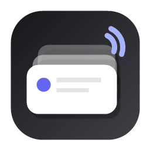

# ToastDesk

Windows notifications that stay visible until you act.

ToastDesk is a Windows 11 desktop app that mirrors Windows notifications into persistent, always-on-top toast cards. It keeps important alerts visible until you open or dismiss them.



## Download

Download the latest Windows build:

- [ToastDesk-Setup-win-x64.msi](https://github.com/nakorncode/toastdeck/releases/latest/download/ToastDesk-Setup-win-x64.msi) - Windows Installer package for normal installation or deployment
- [ToastDesk-Setup-win-x64.exe](https://github.com/nakorncode/toastdeck/releases/latest/download/ToastDesk-Setup-win-x64.exe) - guided setup installer
- [ToastDesk-Portable-win-x64.zip](https://github.com/nakorncode/toastdeck/releases/latest/download/ToastDesk-Portable-win-x64.zip) - standalone portable build; extract and run `ToastDesk.exe`
- [SHA256 checksums](https://github.com/nakorncode/toastdeck/releases/latest/download/ToastDesk-SHA256SUMS.txt)

All release builds are self-contained. No separate .NET runtime install is required.

If Windows SmartScreen warns about an unknown publisher, choose **More info** then **Run anyway**. Code signing is planned after the app identity and installer flow stabilize.

## Status

ToastDesk is early public-preview software. Core notification capture, persistent overlay cards, tray behavior, settings, startup registration, notification actions, notification sounds, and automated Windows release packaging are implemented. Code signing is still in progress.

## Features

- Persistent always-on-top toast cards
- Sonner-style stacked notification layout
- Windows Notification Center capture
- Activity list inside the app
- Tray/background app behavior
- Start with Windows
- Start minimized to tray
- Do Not Disturb mode
- Notification sound presets and custom sound files
- Production-safe bundled sound assets

## Release Flow

Maintainers can publish a GitHub Release by pushing a version tag:

```powershell
git tag v0.1.0
git push origin v0.1.0
```

The GitHub Actions release workflow builds and uploads:

- `ToastDesk-Setup-win-x64.msi`
- `ToastDesk-Setup-win-x64.exe`
- `ToastDesk-Portable-win-x64.zip`
- `ToastDesk-SHA256SUMS.txt`

You can also create the package locally:

```powershell
powershell -ExecutionPolicy Bypass -File .\scripts\publish-release.ps1
```

The local packages are written to `artifacts/release`.

## Requirements

- Windows 11
- Windows notification access permission
- No .NET runtime required when using the self-contained release package

## Run From Source

```powershell
powershell -ExecutionPolicy Bypass -File .\scripts\run-dev.ps1
```

## Build

```powershell
powershell -ExecutionPolicy Bypass -File .\scripts\run-build.ps1
```

## Publish Release Assets Locally

```powershell
powershell -ExecutionPolicy Bypass -File .\scripts\publish-release.ps1
```

The release assets are written to `artifacts/release`.

## Installer

Release packaging creates both installer and standalone assets:

- MSI installer: `ToastDesk-Setup-win-x64.msi`
- EXE installer: `ToastDesk-Setup-win-x64.exe`
- Standalone portable ZIP: `ToastDesk-Portable-win-x64.zip`

Local installer builds require:

- [Inno Setup 6](https://jrsoftware.org/isinfo.php)
- WiX CLI: `dotnet tool install --global wix`

## Notification Sounds

ToastDesk bundles OpenCode notifier sounds from `@mohak34/opencode-notifier` and additional subtle notification sounds from `akx/Notifications`.

See [assets/sounds/README.md](assets/sounds/README.md) for source and license notes.

## Security

ToastDesk reads notification metadata through Windows notification listener APIs after the user grants permission. It stores settings locally under `%LOCALAPPDATA%\ToastDesk`.

Do not publish logs or screenshots that may contain private notification contents.

## License

MIT. See [LICENSE](LICENSE).
